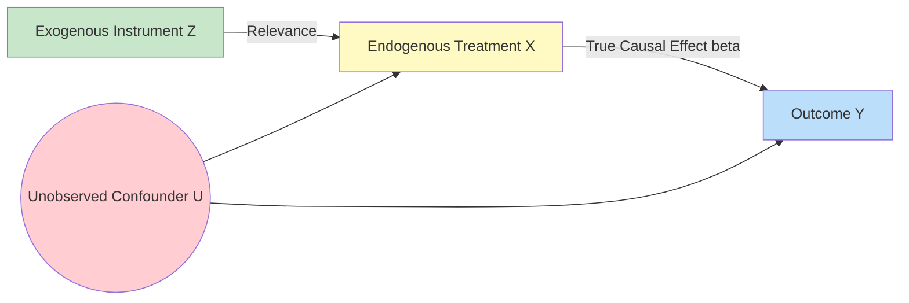

# GenPark Instrumental Variable Two-Stage Least Squares (2SLS) Estimator Skill

Instrumental Variable (IV) Two-Stage Least Squares (2SLS) causal estimator isolating unobserved confounding.

Read more at [GenPark](https://genpark.ai) and the [GenPark MCP Catalog](https://genpark.ai/mcp).

## Features
- Pure Python 2SLS estimator with Stage 1 instrument strength F-test.
- Unbiased causal effect recovery under unobserved endogeneity.
- Zero external dependencies.
